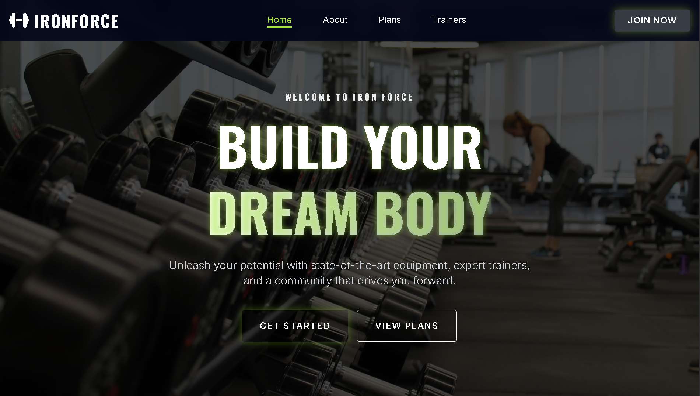
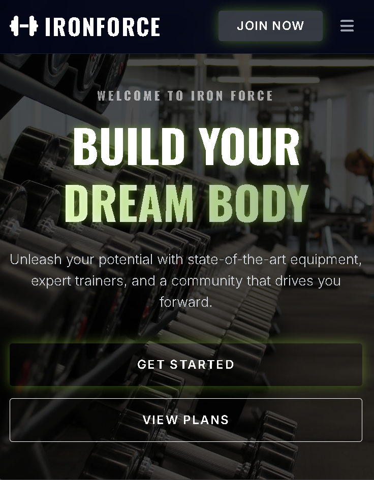

<div align="center">

  

  <a href="https://git.io/typing-svg">
    
  </a>

</div>

<br/>

<div align="center">

  
  
  
  

</div>

---

## 🏋️‍♂️ Introduction

**IRON FORCE** is a cutting-edge Gym & Fitness website template designed to inspire strength and power. It features a bold **Dark Mode UI** with striking **Neon Lime** accents, creating a high-energy atmosphere. Built with clean HTML, Tailwind CSS, and Vanilla JavaScript, it ensures top-tier performance and responsiveness.

## ✨ Key Features

- 🎨 **Dark Neon Aesthetic:** A visually stunning combination of Deep Slate (`#020617`) and Neon Lime (`#a3e635`).
- 📱 **Fully Responsive:** Adapts perfectly to Mobile, Tablet, and Desktop screens.
- 🌫️ **Glassmorphism Navbar:** Modern frosted glass effect on the navigation bar.
- 🖱️ **Interactive Elements:** Smooth hover effects on Pricing Cards and Buttons.
- 📜 **Scroll Spy Navigation:** Active menu links update automatically as you scroll.
- 🚀 **Performance:** Lightweight and fast, using Tailwind CDN (convertible to CLI).

## 🛠️ Tech Stack

- **Structure:** Semantic HTML5
- **Styling:** Tailwind CSS (Utility-first framework)
- **Icons:** FontAwesome 6
- **Typography:** Google Fonts (Oswald & Inter)
- **Interactivity:** Vanilla JavaScript

## 📸 Screenshots

| Desktop Hero View | Mobile Responsive View |
|:---:|:---:|
|  |  |

*(Note: Replace these placeholders with actual screenshots of your website)*

## 🚀 How to Run

1. **Clone the repository:**
   ```bash
   git clone [https://github.com/your-username/iron-force-gym.git](https://github.com/your-username/iron-force-gym.git)

2. Navigate to the folder:
   ```bash
    cd iron-force-gym

3. Launch:
   Simply open the `index.html` file in your browser. No backend server required!

## 🧩 Future Improvements
[ ] Add Multi-page navigation (Contact, Blog).

[ ] Implement Membership Form logic.

[ ] Add BMI Calculator functionality.

[ ] Integrate dark/light mode toggle.

## 🤝 Contributing
Contributions are welcome! If you have ideas to make Iron Force even stronger, feel free to fork and submit a PR.

## 📄 License
This project is licensed under the MIT License.

<div align="center">
Developed with 💪 & ❤️ by <b>[Your Name]</b>
</div>
